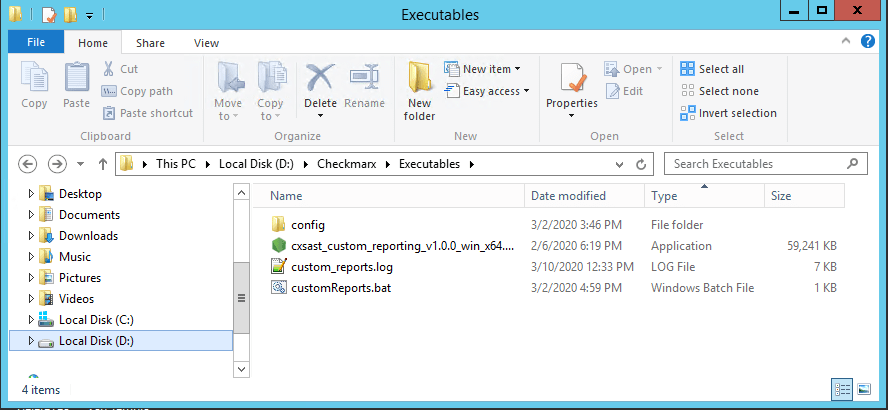
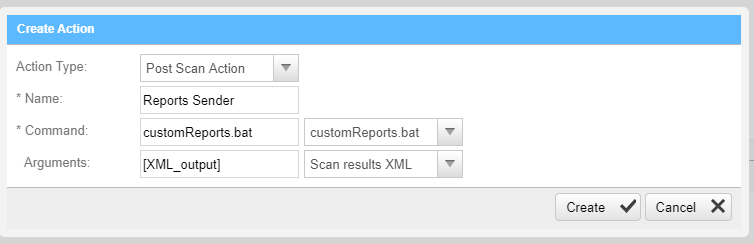

# Executing as a Post Scan Action

One of the most useful ways to run the script is to run it as a post scan action on CxSAST and creating a report for each scan performed.

To create a post scan action you just need:


1. Create a `.bat` file to be used by the post scan action ex:

   ```powershell
   cd /d D:\Checkmarx\Executables
   echo %1 >> custom_reports.log
   CALL ".\cxsast_custom_reporting_v{version}_win_x64.exe" --projectXmlReport '%1' --reportAudience user@email.com >> custom_reports.log
   ```

   This will get the XML file as a parameter from the CxSAST and pass to the `projectXmlReport` argument.

   **Notes:**

   - This is a `ScanSummary` report type just as an example that's why we are using the `projectXmlReport` argument.

   - As you can see there is a `>> custom_reports.log` on the end of the command. This is for output all logs into a file. It's optional but it can be very helpful in for debugging etc.
   
     

2. Place the script, the `.bat` file and the and the `config` folder inside the CxSAST Executables folder usually located on `Checkmarx/Executables` and




3. On CxSAST go to `Management/Scan Settings/Pre & Post Scan Actions` and click on "Create New Actions" button and fill the required fields ex:

   

Notice that the created `.bat` file will be shown as a Command option.

Press the create button and you are set. After every scan the created .bat file will be triggered and a report will be created and send to the specified `reportAudience` emails.
